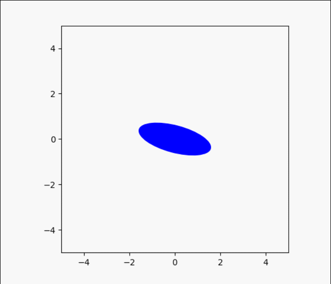

# Particle Deformation

## Introduction
Numerical simulation of particle deformation in the fluid flow.

We will explore the deformation of fluid particle in some turblent flow, such as canal, 
pipe flow(rond, square, L), then analyse the statistic comportment of particle deformation 
in these situations.

## Visualization
* Two dimensional deformation

* 3 dimensional deformation

## Structure
* case_2d: 2d fluid flow validation and simulation
* case_3d: 3d fluid flow validation and simulation
* common: implementations of the core function
    * fileIO
    * paraSolver
    * visualization: geometric simulation
    
* example: some running results
* exp: where we do experiments using functions implemented in common
  * exp_sing: study the deformation behavior of a single particle
  * exp_stat: statical analyses of particle deformation

## Function

* ParaSolver: solve deformation parameters of particle 
* StatSolver: statistical analyse
* Visualization: geometric simulation

## Usage
* open the *exp* folder
* enter the *exp_sin* folder for single particle tracer, 
enter the *exp_stat* folder for statistic experiment

## TODO

* Performance optimization

## Reference

* McKenzie D. Finite deformation during fluid flow[J]. Geophysical Journal International, 1979, 58(3): 689-715.
* Fang L, Wang S L, Hong J Y. Analytical expressions of the deformation limit of fluid particles[J]. Physics Letters A, 2017, 381(48): 3996-4004.
* Xu H, Pumir A, Bodenschatz E. The pirouette effect in turbulent flows[J]. Nature Physics, 2011, 7(9): 709-712.
* Subramanian N, Kellogg L H, Turcotte D L. Statistics of Advective Stretching in Three-dimensional Incompressible Flows[J]. Journal of Statistical Physics, 2009, 136(5): 926-944.
* Zhao L, Andersson H I. Why spheroids orient preferentially in near-wall turbulence[J]. Journal of Fluid Mechanics, 2016, 807: 221.

